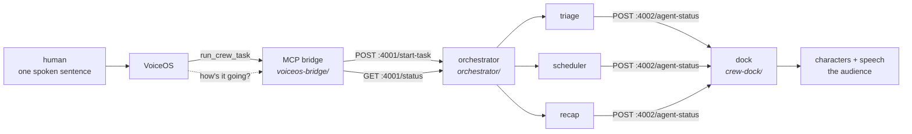

# CrewOS

> **Working name.** Not final — but a thing needs calling something, and it has been
> "the crew" in every commit message for two days, so: CrewOS.

**You say one sentence out loud. A crew of agents does the work, and you watch them
do it.**

Not a chat window. Three characters walk out along the bottom of your screen, talk to
each other about your inbox in three different accents, and your morning is gone by
the time they stop. The only thing between the agents and your mailbox is a speaker
and a microphone.

```
"Clean up my inbox and schedule everything."

  triage    (Irish)      Archiving fourteen — six newsletters, eight receipts and alerts.
  scheduler (British)    Two o'clock tomorrow is open — David Chen, that's yours.
  triage    (Irish)      Done: inbox down to two real emails.
  scheduler (British)    Done: both booked, calendar holds together.
  recap     (Australian) Done: inbox cleared, meetings booked, nothing left for you.
```

Eighteen emails in. Fourteen archived on sight, two meetings booked and their requests
filed, **two left — both of which actually need a human.** ~45 seconds, one sentence of
human input, nobody touches the machine after it.

---

## See it in 30 seconds

On a Mac — no account, no API key, no network, no model spend:

```bash
./run-demo.sh fake
```

That is the entire show: dock up, characters walking, narration spoken out loud, all of
it canned. Swap in three real headless agents reasoning about a real inbox:

```bash
./run-demo.sh          # needs the `claude` CLI, ~45s
./run-demo.sh stop     # kill everything
```

The dock is Swift/AppKit, so `run-demo.sh` is macOS-only. **Everything upstream of it
runs anywhere** — on Windows or Linux, watch the same narration arrive as HTTP:

```bash
node orchestrator/fake-dock.js       # stand-in for the dock, prints what it receives
FAKE=1 node orchestrator/server.js   # the orchestrator, canned agents
curl -X POST localhost:4001/start-task -H 'content-type: application/json' \
  -d '{"instructions":"clean up my inbox and schedule everything"}'
```

`./checkpoint.sh` runs every check this machine is capable of and skips the rest.

---

## How it fits together

Three processes on one Mac, two HTTP interfaces, no message bus and no shared database.



Two contracts, frozen on day one so three people could build against them in parallel
without waiting on each other:

| | owner | called by | |
|---|---|---|---|
| `POST :4001/start-task` · `GET :4001/status/:id` | orchestrator | the bridge | start work, ask how it's going |
| `POST :4002/agent-status` | dock | the orchestrator | one narration line → one character speaking |

Everything is Node stdlib or Swift stdlib. **No `npm install`, no build step, no
dependency that can fail at 5:55pm.** The dock compiles with `swiftc` alone in ~3
seconds — no `.xcodeproj`, no signing.

---

## Ideation: how it got to this shape

The interesting part of this project is what got thrown away.

**"An agent that does your email" is a chat app.** The first framing was a task
orchestrator with a web UI. It was correct and completely unmemorable — the output of
an agent swarm is a wall of text, and a wall of text is what every other demo also
produces. The pivot was deciding that **watching the work is the product**: characters
on the dock, narrating themselves out loud, so the audience follows three agents
working in parallel without reading anything.

That one decision drove everything after it.

**A general planner became a hardcoded router.** Routing is four keyword patterns over
the instruction (`inbox|email|mail` → triage, `schedul|calendar|meeting|book` →
scheduler), and if nothing matches it spawns agents anyway. A planner is a thing that can be wrong
on stage. This one can't be — the worst case is the right characters doing roughly the
right thing.

**A four-file TypeScript service became one file of Node stdlib.** ~260 lines, no build
step, restarts instantly, nothing to `npm install`. The frozen part is the HTTP
contract, and that never changed.

**Text-to-speech stayed on the platform.** An external TTS would have added an API key,
a network call and latency on stage to buy something macOS already does. The crew's
three personalities are three built-in voices (Moira / Daniel / Karen — Irish, British,
Australian) plus a *"Who you are"* block in each role's prompt. The one real upgrade is
a GUI download of the Enhanced voice files, which changes no code at all.

**The inbox stayed real, over two safer options.** Apple Mail has a native path through
VoiceOS and needs no OAuth — but it can't be seeded deterministically, and it couldn't
be tested at all from the Windows machine. Narrating over fake data was the safe pick
and would have made half the demo a lie. Instead the MCP bridge owns Gmail, with the
*same six tools wired two ways from one implementation*: VoiceOS calls them (loop stays
voice all the way through), or the agents call them directly (fallback if transcription
is unreliable). Choosing between those at 5pm is a one-line change, not a rebuild.

**Two speech streams nearly collided, and the fix was a device, not a timer.** The
agents speak commands *to* VoiceOS; the dock speaks narration *to the room*. Both were
landing on the same speakers and the same microphone. Timing-based schemes need the two
processes to know about each other. Separating them by output device needs nothing —
and it's measured, not assumed: narration on the speakers reads `0.000000` on the
virtual mic, commands read `0.804261`.

**Pacing came from a measurement after two guesses were wrong.** The model emits all
its narration in one burst, so lines have to be paced or a character jumps straight to
"Done:". 1400ms was a guess; two of ten lines were dropped. 2200ms was a better guess;
still short. Timing how long a line actually takes to *speak* gave 2.8–4.3s, average
3.8s — so the pacing is 4000ms and nothing is dropped. The ceiling was always speech
rate, and the fix was to stop guessing at it.

---

## Execution: what actually works

Everything below is verified by running it, not by reading the code. `./checkpoint.sh`
is one command all three machines run to prove they're looking at the same system.

| | state |
|---|---|
| orchestrator, all 3 execution modes | **PASS** |
| full chain, real headless agents | **PASS — ~45s end to end** |
| dock receives | **16/16 lines, correct order** |
| dock speaks | **10/10 lines, 0 dropped** |
| MCP protocol (initialize, tools/list, tools/call) | **PASS**, over real stdio pipes |
| Gmail/calendar tools | **PASS — every number a character says is true of the mailbox** |
| the follow-up loop ("what's the crew doing?") | **PASS**, spoken sentence, no taskId needed |
| demo-seed | **PASS — 18 emails, 8 events, counts asserted** |
| audio loopback into the virtual mic | **PASS — peak 0.80, measured** |
| audio split (narration vs commands) | **PASS — 0.00 vs 0.80, measured** |
| VoiceOS transcribing the audio | **blocked — Pro trial not active** |

### The bugs that testing found, which is the actual work

Every one of these would have hit on stage, and every one of them looked fine in a log:

- **The orchestrator's log is not evidence that anything reached the audience.** It
  reports what it *sent*. Dock POSTs were fire-and-forget `fetch()` calls, so they
  raced — `waking up` arrived *after* a later line, which on stage reads as a character
  walking backwards.
- **A bad audio device name made the dock completely silent while the log looked
  perfect.** `say -a` reports an unknown device on *its* stderr and the exit code was
  never checked. Device names are now resolved once at startup, and an unknown one
  falls back to the built-in speakers loudly instead of going quiet.
- **The dock crashed on a fast burst of messages** — Swift's `suffix()` returns a slice
  that keeps the parent's indices, so inserting at 0 traps. The app died silently and
  the orchestrator's `.catch(() => {})` swallowed the connection error.
- **`checkpoint.sh` passed while grading a dock binary older than its source.** Both
  scripts guarded on the binary *existing*, never on it being fresh. A `git pull` brought
  new Swift and every check still passed on the previous build.
- **The demo's best line wasn't true.** The seeded calendar left 1pm free, David Chen's
  email says "anytime after 1pm", so the scheduler correctly booked 1pm while the
  character said *"Booking two PM"*. There's now a 1pm vendor call so 2pm is genuinely
  the first free slot. A separate assertion caught the newsletter matcher also grabbing
  Calendly's "your *weekly* availability" — seven archived while the character said six.
- **The crew talked about an agent that had already gone home.** The final `Done:` line
  is posted twice — once as `working`, then as `done` — and in that window the status
  reply said *"Recap reports inbox cleared"* in the present tense.

### Known-broken, on purpose or not

- **The voice loop's last link is untested.** Audio provably reaches the virtual
  microphone; whether VoiceOS *transcribes* it is unverified, because the app is behind
  a paywall on both machines that have it installed. Everything around it is scripted
  and dry-run verified — it's a five-minute test, not a workstream.
- **The `google` backend needs a demo account and OAuth credentials** that don't exist
  yet. The `fake` backend needs nothing and does real archiving and real booking with
  real numbers, so the inbox half of the demo works on any machine regardless.
- **In `fake` mode a research crew signs off claiming it cleared an inbox** — the canned
  closing line is hardcoded for the inbox demo. Off the rehearsed path, tracked in
  `coordination.md`.

---

## Repo layout

```
orchestrator/         the brain — HTTP API, agent spawning, narration pacing
  server.js             one file, Node stdlib, ~260 lines
  prompts/              one file per role + one per execution mode
  test.sh               contract, routing, and dock push
voiceos-bridge/       the ears and hands
  mcp-server/           8 MCP tools over stdio; Gmail + Calendar, two backends
  demo-seed/            builds a deterministic 18-email, 8-event demo mailbox
  audio-loopback/       the virtual-microphone rig (macOS only)
  verify.ps1            every bridge check in one command
crew-dock/            the face — borderless Swift/AppKit windows above the dock
  Sources/              characters, speech bubbles, narration, the :4002 listener
  build.sh              swiftc only, ~3s, no Xcode
docs/
  onboarding.md         start here — clone to a running demo, and who owns which files
  demo-script.md        the exact rehearsed run, beat by beat
coordination.md       the day's log — decisions, findings, blockers
checkpoint.sh         one command that proves three machines agree
run-demo.sh           the whole show, one command
```

Character art is fetched from [lil-agents](https://github.com/ryanstephen/lil-agents)
(MIT) at build time, not committed.

---

## Built by five people across five machines

Split along the two frozen interfaces and by file ownership, so nobody is ever blocked
on anyone else's process being up. Each side has a stub of the others.

| | workstream | machine |
|---|---|---|
| **A** — Vraj | orchestrator, role prompts, the dock, the audio rig | Mac — the demo machine |
| **B** — Sameer | MCP bridge, Gmail/Calendar tools, demo-seed | Windows |
| **C** — Abhishek | dock characters, speech bubbles, narration | Mac |
| **D** — Yaseen | character art + visual identity | |
| **E** — Rukiya | rehearsal, resilience, backup rig | |

New here? **[`docs/onboarding.md`](docs/onboarding.md)** is the front door — clone to a
running demo in about sixty seconds, plus the file-ownership map and the merge ritual.
`coordination.md` is the live state of the day.

Two of the three constraints that shaped the build were machine facts nobody could
change: **the demo Mac has Command Line Tools but no full Xcode**, so anything with an
`.xcodeproj` cannot be built on the machine that matters — hence a dock that compiles
with `swiftc` alone. And **the `fn` key cannot be synthesized in software** on macOS, so
no script can press it — hence a demo designed around one human press of hands-free
mode rather than a per-utterance trigger.

Working in the repo? Type `/crew` in Claude Code — it loads the frozen contracts, the
commands to test your own side, and the gotchas that have already cost time.

---

## Status

Hackathon project, demoing Sunday 6pm at Frontier Tower SF. It is built for **one
rehearsed run**, and it is honest about that: things are hardcoded where hardcoding
makes them reliable. There are four fallback rungs, each a complete show, and dropping
one is a different word on the command line rather than an edit under pressure.

The name is provisional. The demo is not.
