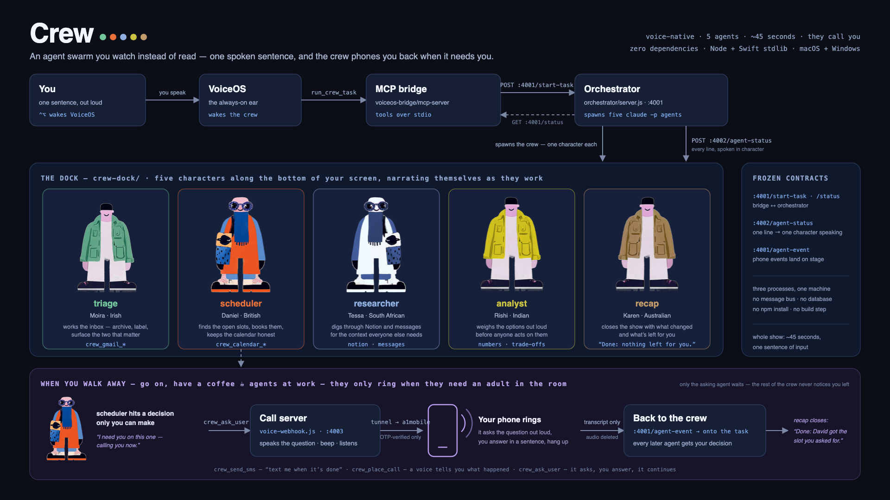
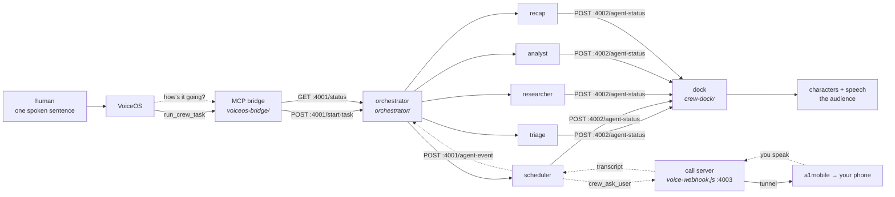

<div align="center">

# Crew

### An agent swarm you watch instead of read.

Say one sentence out loud. Five characters appear along the bottom of your screen, work together through your inbox, calendar, Notion, and messages in five different accents, and hand tasks between themselves until it's done. About 45 seconds, and you don't touch the machine after the first sentence.

When you walk away from the laptop while a big task is in progress, they phone you. An agent that hits a decision only you can make rings your actual phone, asks the question out loud, and the crew carries on from your answer.

`voice-native` · `5 agents` · `~45 seconds` · `they call you` · `zero dependencies` · `macOS + Windows`



</div>

---

```
"Clean up my inbox and schedule everything."

  triage    (Irish)      Archiving fourteen — six newsletters, eight receipts and alerts.
  scheduler (British)    Two o'clock tomorrow is open — David Chen, that's yours.
  triage    (Irish)      Done: inbox down to two real emails.
  scheduler (British)    Done: both booked, calendar holds together.
  recap     (Australian) Done: inbox cleared, meetings booked, nothing left for you.
```

Eighteen emails in. Fourteen archived on sight, two meetings booked and their requests
filed, two left that actually need a human. 45 seconds, one sentence of input.

Now the case where one of those two needs you and you're not at the desk:

```
  scheduler (British)    I need you on this one. Calling you now:
                         two meetings both want 2pm tomorrow — David or Priya?

        ☎  your phone rings. you answer it. you say it out loud.

  scheduler (British)    You said: give the 2pm to David, offer Priya Thursday.
  scheduler (British)    Done: David at two, Priya offered Thursday morning.
  recap     (Australian) Done: inbox cleared, and David got the slot you asked for.
```

You never touched the laptop. Your answer was transcribed, handed back to the agent that
asked, and stored on the task, so the recap closed the show knowing what you decided.

---

## Run it

No account, no API key, no network, no model spend:

```bash
./run-demo.sh fake
```

That's the whole show: dock up, characters walking, narration spoken aloud. Swap in real
headless agents reasoning about a real inbox:

```bash
./run-demo.sh            # real agents, ~45s
./run-demo.sh live       # the mailbox really changes, and the crew can phone you
./run-demo.sh phone-fake # the crew "phones" you with nothing outside this laptop
./run-demo.sh voice      # you speak; VoiceOS drives the crew
./run-demo.sh stop       # kill everything
```

The phone half is one command. It starts the call server, opens a tunnel, points the
number at it, then proves the whole path from outside rather than assuming it:

```bash
./voiceos-bridge/mcp-server/phone.sh up      # and `check` for the preflight
```

On Windows, the same pipeline, the same ports, the same entry point:

```powershell
.\run-demo.ps1 -Real     # real agents -- verified at 16 lines, 44s
.\run-demo.ps1 -Talk     # the demo as a conversation -- this is the pitch
.\run-demo.ps1 -Stop
```

`./checkpoint.sh` runs every check this machine is capable of and skips the rest.

---

## Why

Agent swarms produce a wall of text. You can't tell whether five agents are working or one
is stuck. You can't tell what they decided or why. You read the transcript afterwards and
hope.

Crew makes the work the thing you watch. Characters with faces and voices on your desktop,
narrating themselves as they go, so you can follow five agents working in parallel without
reading anything. When the analyst contradicts the researcher, you hear it.

One press of `⌃⌥` opens VoiceOS's ear and wakes the crew in the same gesture. You say what
you want. They ask if they need to. Then they go.

### When you're not at the desk

Watching only works while you're in the chair. Leave the room and a dock full of characters
is worth nothing.

Most agent products handle this by queuing the question and waiting for you to come back.
The work stops at exactly the point where a human was needed, and you find out an hour
later that nothing happened.

Crew calls you. Three tools reach a real phone:

| tool | what it does |
|---|---|
| `crew_send_sms(body)` | a real text: *"…and text me when it's done"* |
| `crew_place_call(message)` | your phone rings and a voice tells you what happened |
| `crew_ask_user(question)` | the stuck-agent loop: it asks, you answer out loud, it continues |

The third one is the interesting one. An agent hits something only you can decide, and
instead of guessing or stopping:

1. It says on the dock what it's about to ask, then dials. The room hears the question
   while your phone rings.
2. The call speaks the question, beeps, and listens.
3. You answer in a sentence and hang up.
4. The recording is transcribed and deleted immediately. The audio never sits on disk for
   longer than it takes to read it. Only your words are kept.
5. Those words go back to the agent as the tool's result and onto the task, so every agent
   that runs afterwards is handed your decision instead of re-guessing it.

The agent is blocked inside a single tool call for the whole conversation, which is why it
announces itself first. Without that the dock freezes for two minutes at exactly the moment
the interesting thing is happening in your hand.

Consent is enforced by the API rather than by our good intentions. a1mobile only dials
numbers a human has OTP-verified, so the blast radius is exactly the phones we deliberately
verified. The OTP step is a CLI command that no agent can reach.

---

## How it works

Three processes on one machine, two HTTP interfaces, no message bus and no database. A
fourth process exists only when the crew can phone you.



Two contracts were frozen on day one so five people could build against them in parallel
without waiting on each other. A third was added later, additively, so nothing above it
changed shape:

| | owner | called by | |
|---|---|---|---|
| `POST :4001/start-task` · `GET :4001/status/:id` | orchestrator | the bridge | start work, ask how it's going |
| `POST :4002/agent-status` | dock | the orchestrator | one narration line → one character speaking |
| `POST :4001/agent-event` | orchestrator | the bridge | *"I'm calling you"* / *"you said X"* → onto the dock, and onto the task |

The third one keeps the stage alive while an agent is on the phone, and it's how your
spoken answer reaches the agents that run after the one you talked to.

Everything is Node stdlib or Swift stdlib. No `npm install`, no build step, no dependency
that can fail at 5:55pm. The dock compiles with `swiftc` alone in about 3 seconds, with no
`.xcodeproj` and no signing.

### The crew grows with the sentence

Routing is keyword matching against a fixed roster. We skipped a planner because a planner
can be wrong in front of a room.

| what you say | who shows up |
|---|---|
| "clean up my inbox" | 2 — triage, recap |
| "clean up my inbox and schedule everything" | 3 — the rehearsed run |
| "…find out what's urgent and schedule the meetings" | 4 — + researcher |
| "…research what's urgent, analyse which threads need a reply, and schedule the meetings" | **5 — the whole crew** |

The analyst waits for the researcher and is handed what it actually found, instead of
re-deriving it in parallel:

```
researcher  Done: only Marcus's staging outage is genuinely urgent.
[crew] wave 2: analyst (has triage, scheduler, researcher)
analyst     One of these is not like the others — Marcus, waiting since yesterday.
analyst     Done: Reply to Marcus about staging first.
recap       Done: inbox down to two, both meetings booked, reply to Marcus first.
```

The analyst named Marcus because the researcher handed it that finding. The recap then
carried the analyst's recommendation rather than just repeating counts.

---

## What's proven

Everything below was verified by running it. `./checkpoint.sh` is one command all five
machines run to prove they agree, and it has passed on all five.

| | state |
|---|---|
| orchestrator, all 3 execution modes | **PASS** |
| full chain, real headless agents | **PASS — ~45s end to end** |
| dock receives | **16/16 lines, correct order** |
| dock speaks | **10/10 lines, 0 dropped** |
| MCP protocol (initialize, tools/list, tools/call) | **PASS**, over real stdio pipes |
| Gmail/calendar tools | **PASS — every number a character says is true of the mailbox** |
| `direct` mode really calls the tools | **PASS — tool calls counted, not assumed** |
| the follow-up loop ("what's the crew doing?") | **PASS**, spoken sentence, no taskId needed |
| the phone loop: announce → ask → answer → back to the agent | **PASS — `test-phone.js`, over real stdio pipes** |
| your spoken answer reaches the agents that run after | **PASS — it's on the task, not in one agent** |
| the dock stays alive while an agent is on the phone | **PASS — announced before the dial, in queue order** |
| a dead phone stack does not kill the agent | **PASS — degrades to "decide it yourself", never an error** |
| the deterministic phone route (no key, no tunnel, no network) | **PASS — same question, same answer, every time** |
| real SMS · real answered call · transcription | **PASS — verified live on the demo phone before the merge**¹ |
| demo-seed | **PASS — 18 emails, 8 events, counts asserted** |
| audio loopback into the virtual mic | **PASS — peak 0.80, measured** |
| audio split (narration vs commands) | **PASS — 0.00 vs 0.80, measured** |
| VoiceOS Crew app / MCP registration | **PASS — Ready on macOS and Windows** |
| VoiceOS confirmation behavior | **PASS — `readOnlyHint` honored on both platforms** |
| the same pipeline on Windows | **PASS — 16 lines, the Mac's exact number** |
| **real agents on Windows** | **PASS — 16 lines, 44s** |
| a second Mac, clean clone → spoken demo | **PASS — 72s, 10/10 spoken** |
| five agents on screen at once | **PASS — spoken but not shown: 0** |

Every hop is individually proven, including the one everyone assumes: VoiceOS transcribed
audio it never heard through a microphone. BlackHole has no microphone, so that audio can
only have arrived through the digital loopback.

¹ The live phone path (a real text, a real answered call, a real transcript) was proven on
hardware before this was merged. Everything above it in the table was proven after, on a
machine with no credentials at all. The loop, the announcements, the hand-off to later
agents and the fallback all hold without a phone in the room. On the demo Mac, the one
command that re-proves the real path end to end is
`./voiceos-bridge/mcp-server/phone.sh check`. It fetches our own webhook back through the
public tunnel, so a dead tunnel or a stale pointing can't pass it.

---

## What was actually hard

The instruments, not the agents.

Nine times on this project a check reported success while looking at the wrong thing. Every
one of these would have hit on stage, and every one looked fine in a log:

- **The orchestrator's log is not evidence that anything reached the audience.** It reports
  what it sent. Dock POSTs were fire-and-forget, so they raced, and `waking up` arrived
  after a later line. On stage that reads as a character walking backwards.
- **A bad audio device name made the dock completely silent while the log looked perfect.**
  `say -a` reports unknown devices on its own stderr, and the exit code was never checked.
- **`checkpoint.sh` passed while grading a dock binary older than its source.** A `git pull`
  brought new Swift and every check still passed on the previous build.
- **The demo's best line wasn't true.** The seeded calendar left 1pm free, so the scheduler
  correctly booked 1pm while the character said *"Booking two PM"*. There's now a 1pm
  vendor call so 2pm is genuinely the first free slot.
- **We spent a day thinking the voice loop was broken.** Every check queried the
  `dictations` table, which in VoiceOS 0.1.21 is empty and legacy: 0 rows, always.
  Transcripts land in `voice_sessions`.
- **The closer's canned sign-off was hardcoded to the inbox demo**, so the five-agent
  research crew ended the show claiming it had cleared a mailbox nobody touched. Last line,
  spoken aloud, and false. It's now built from the roster.
- **`spawn('claude')` cannot start the CLI on Windows and never could.** npm ships an
  extensionless shell shim (Node: `ENOENT`) and a `.cmd` (Node: `EINVAL` since the
  CVE-2024-27980 fix). Only `claude.exe` is spawnable without a shell. `checkpoint.sh`
  proved the CLI worked from a shell, which is not what the orchestrator does, so it went
  green on a box where no agent could ever start.
- **The phone rang and the dock said nothing about it, twice, for two different reasons.**
  First because an agent blocked inside `crew_ask_user` writes nothing to stdout for two
  minutes, so there was no line to pace. Then, after the announcement was added, because a
  character is marked "signed off" when its `Done:` line is queued rather than spoken, and
  the model usually emits all its narration in one event. The announcement arrived a second
  later and was dropped by a guard meant for chatty agents. Real events now jump the queue
  ahead of the sign-off instead of being filtered by it.
- **A test reported on a server it hadn't started.** `pkill` doesn't exist on Windows, so
  the old orchestrator kept :4001, the new one exited with `EADDRINUSE`, and the run failed
  against code that no longer existed. That's the same trap `test.sh` documents, walked
  straight into while testing the fix for something else.

The rule that came out of it: a check must run the code path the demo runs, not a
convenient equivalent. Suspect the instrument before the code.

---

## Design decisions

**A general planner became a hardcoded router.** Four keyword patterns. A planner can be
wrong on stage; this can't. The worst case is the right characters doing roughly the right
thing.

**Text-to-speech stayed on the platform.** External TTS would add an API key, a network call
and stage latency to buy something the OS already does. The crew's personalities are
built-in voices plus a *"Who you are"* block in each role's prompt. Piper is an optional
open-source upgrade that changes no code.

**Tool replies stopped being JSON, because VoiceOS reads them back verbatim.**
`triage (working): Archiving six…` spoken aloud becomes *"triage open paren working close
paren colon"*. It now answers *"Triage is archiving six newsletters and Scheduler is booking
two PM with David Chen."*

**Two speech streams nearly collided, and a device fixed it rather than a timer.** Agents
speak to VoiceOS; the dock speaks to the room. Separating them by output device needs no
coordination between processes, and it's measured: narration reads `0.000000` on the virtual
mic, commands read `0.804261`.

**Pacing came from a measurement after two guesses were wrong.** 1400ms dropped two lines in
ten. 2200ms still dropped some. Timing how long a line takes to speak gave 2.8–4.3s, so
pacing is 4000ms and nothing is dropped. The ceiling was always speech rate.

**Every irreversible thing got a rung below it.** `fake` for the agents, `phone-fake` for the
phone. The real phone needs five things up at once (team key, verified number, call server,
public tunnel, transcription), and a hackathon demo can't be one bad wifi away from having
no third act. The simulated route depends on nothing outside the process, answers the same
question the same way every time, and drives the dock identically. Only the ringing is
missing, and only the operator knows.

**Announce before you dial.** The agent is blocked for the whole call, so the announcement
has to be sent before the thing that blocks it. Said afterwards it's just narration. Said
first, it's how the room knows what's being asked while the phone is still ringing.

**Be the collision instead of avoiding it.** VoiceOS already registers `⌃⌥` as its own
trigger, so the dock listens for exactly that. One press opens VoiceOS's ear and wakes the
crew, and `fn`+`space`, the one step no script could ever perform, stops being needed.

---

## Repo layout

```
orchestrator/         the brain — HTTP API, agent spawning, narration pacing
  server.js             one file, Node stdlib
  prompts/              one file per role + one per execution mode
voiceos-bridge/       the ears, the hands, and the phone
  mcp-server/           11 MCP tools over stdio; Gmail + Calendar, two backends
    a1mobile.js           real SMS and real calls; OTP setup is CLI-only, never a tool
    voice-webhook.js      what an answered call says, and what it hears back
    phone.sh              the phone stack in one command — up / check / down
  demo-seed/            a deterministic 18-email, 8-event demo mailbox
  audio-loopback/       the virtual-microphone rig
crew-dock/            the face — borderless Swift/AppKit windows above the dock
  Sources/              characters, speech bubbles, narration, the :4002 listener
docs/
  onboarding.md         clone to a running demo in ~60 seconds
  demo-script.md        the exact rehearsed run, beat by beat
  runbook.md            what to do when it breaks
  a1mobile.md           the phone: setup, failure modes, and the kill switches
coordination.md       the build log — every decision, finding and blocker
checkpoint.sh         one command that proves all five machines agree
```

---

## Built by five people across five machines

Split along the two frozen interfaces and by file ownership, so nobody was ever blocked on
anyone else's process being up.

| | workstream | machine |
|---|---|---|
| **Vraj** | orchestrator, role prompts, the dock, the audio rig | Mac — the demo machine |
| **Sameer** | MCP bridge, Gmail/Calendar tools, demo-seed | Windows |
| **Abhishek** | dock characters, speech bubbles, narration | Mac |
| **Yaseen** | character art + visual identity | Mac |
| **Rukaiya** | rehearsal, resilience, backup rig | Mac |

Four Macs and one Windows box, which is why there are two runners, and why the Windows half
caught bugs the Macs never could.

Two of the three constraints that shaped the build were machine facts nobody could change.
The demo Mac has Command Line Tools but no full Xcode, so anything with an `.xcodeproj`
couldn't be built on the machine that matters, which is why the dock compiles with `swiftc`
alone. And the `fn` key cannot be synthesized in software on macOS, which is what eventually
pushed the trigger onto VoiceOS's own chord.

Working in the repo? Type `/crew` in Claude Code. It loads the frozen contracts, the
commands to test your own side, and the gotchas that have already cost time.

---

## Limits

We'd rather tell you than have you find out:

- **Transcription quality over the loopback is imperfect.** The path works end to end, but a
  full spoken sentence once came back as `"Log"`. The rehearsed run doesn't depend on it.
- **The `google` backend needs a demo account and OAuth credentials.** The `fake` backend
  needs neither and does real archiving and real booking with real numbers, so the inbox
  half works on any machine.
- **The five-agent run is 90 seconds and less rehearsed than the 45-second one.** Better
  story, riskier opener.
- **Accessibility must be granted to the app that launches the dock** before it starts, and
  that app must be restarted afterwards. "hotkey ready" can otherwise be a false green.
- **The phone needs a public tunnel, and a free tunnel's address changes every time.** An
  answered call runs a webhook that must be reachable from the open internet, so
  `phone.sh up` re-points the number on every start. Point it once by hand and the next run
  rings a phone that then says nothing, which is the worst failure we have.
- **A call can only reach a number someone OTP-verified.** That's a deliberate ceiling.
  Verification is a CLI step a human does once, and no agent can reach it.
- **We transcribe the answer ourselves.** a1mobile doesn't forward Telnyx's transcription
  callback, so the recording is fetched, read by OpenAI's API (~2s) or local whisper, then
  deleted whether that succeeded or failed. Only the text survives, in a gitignored log. The
  call never claims to be recorded, because nothing is kept.
- **`crew_ask_user` can take up to two minutes.** In `direct` mode the agent kill-timer sizes
  itself around that automatically. If you override `AGENT_TIMEOUT_MS`, keep it above
  `CREW_ASK_WAIT_MS` or you'll SIGKILL an agent mid-conversation with a human.

---

<div align="center">

**Built at Hack with VoiceOS · Frontier Tower SF · 9 August 2026**

Five machines. Two frozen contracts. Zero dependencies. One sentence in.

</div>
