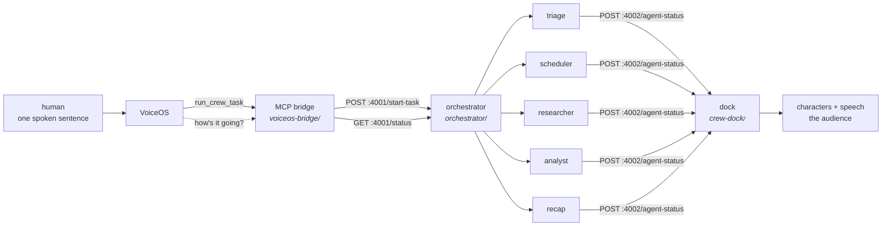

<div align="center">

# Crew

### Say one sentence out loud. Watch a crew of agents do your morning.

**Not a chat window. Not a spinner. Five characters walk out along the bottom of your
screen, talk to each other about your inbox in five different accents, and hand work
between themselves until it's done.**

`voice-native` · `5 agents` · `~45 seconds` · `zero dependencies` · `macOS + Windows`

</div>

---

```
"Clean up my inbox and schedule everything."

  triage    (Irish)      Archiving fourteen — six newsletters, eight receipts and alerts.
  scheduler (British)    Two o'clock tomorrow is open — David Chen, that's yours.
  triage    (Irish)      Done: inbox down to two real emails.
  scheduler (British)    Done: both booked, calendar holds together.
  recap     (Australian) Done: inbox cleared, meetings booked, nothing left for you.
```

Eighteen emails in. Fourteen archived on sight, two meetings booked and their requests
filed, **two left — both of which actually need a human.** ~45 seconds, one sentence of
human input, and nobody touches the machine after it.

---

## Try it in 30 seconds

No account, no API key, no network, no model spend:

```bash
./run-demo.sh fake
```

That's the whole show — dock up, characters walking, narration spoken aloud. Swap in real
headless agents reasoning about a real inbox:

```bash
./run-demo.sh          # real agents, ~45s
./run-demo.sh live     # the mailbox really changes
./run-demo.sh voice    # you speak; VoiceOS drives the crew
./run-demo.sh stop     # kill everything
```

On Windows, the same pipeline, the same ports, the same entry point:

```powershell
.\run-demo.ps1 -Real     # real agents -- verified at 16 lines, 44s
.\run-demo.ps1 -Talk     # the demo as a conversation -- this is the pitch
.\run-demo.ps1 -Stop
```

`./checkpoint.sh` runs every check this machine is capable of and skips the rest.

---

## The idea

> **Every other agent product runs in the background. That's the bug, not the feature.**

An agent swarm's output is a wall of text, and a wall of text is what every demo produces.
You can't tell whether five agents are working or one is stuck. You can't tell what they
decided or why. So you read a transcript afterwards and hope.

Crew makes the work **the thing you watch**. Characters with faces and voices, on your
desktop, narrating themselves as they go — so you follow five agents working in parallel
without reading anything. When the analyst contradicts the researcher, you *hear* it.

One press of `⌃⌥` opens VoiceOS's ear and wakes the crew in the same gesture. You say what
you want. They ask if they need to. Then they go.

---

## How it works

Three processes on one machine, two HTTP interfaces, no message bus and no database.



Two contracts, frozen on day one so five people could build against them in parallel
without waiting on each other:

| | owner | called by | |
|---|---|---|---|
| `POST :4001/start-task` · `GET :4001/status/:id` | orchestrator | the bridge | start work, ask how it's going |
| `POST :4002/agent-status` | dock | the orchestrator | one narration line → one character speaking |

**Everything is Node stdlib or Swift stdlib. No `npm install`, no build step, no dependency
that can fail at 5:55pm.** The dock compiles with `swiftc` alone in ~3 seconds — no
`.xcodeproj`, no signing.

### The crew grows with the sentence

Routing is keyword matching against a fixed roster, not a planner — a planner is a thing
that can be wrong in front of a room.

| what you say | who shows up |
|---|---|
| "clean up my inbox" | 2 — triage, recap |
| "clean up my inbox and schedule everything" | 3 — the rehearsed run |
| "…find out what's urgent and schedule the meetings" | 4 — + researcher |
| "…research what's urgent, analyse which threads need a reply, and schedule the meetings" | **5 — the whole crew** |

The analyst *waits* for the researcher and is handed what it actually found, rather than
re-deriving it in parallel. That's the difference between five agents working near each
other and a crew:

```
researcher  Done: only Marcus's staging outage is genuinely urgent.
[crew] wave 2: analyst (has triage, scheduler, researcher)
analyst     One of these is not like the others — Marcus, waiting since yesterday.
analyst     Done: Reply to Marcus about staging first.
recap       Done: inbox down to two, both meetings booked, reply to Marcus first.
```

The analyst named Marcus because the researcher handed it that finding. The recap carried
the analyst's *recommendation*, not just counts.

---

## What's proven

Everything below is verified by running it, not by reading the code. `./checkpoint.sh` is
one command all five machines run to prove they agree, and it has passed on all five.

| | state |
|---|---|
| orchestrator, all 3 execution modes | **PASS** |
| full chain, real headless agents | **PASS — ~45s end to end** |
| dock receives | **16/16 lines, correct order** |
| dock speaks | **10/10 lines, 0 dropped** |
| MCP protocol (initialize, tools/list, tools/call) | **PASS**, over real stdio pipes |
| Gmail/calendar tools | **PASS — every number a character says is true of the mailbox** |
| `direct` mode really calls the tools | **PASS — tool calls counted, not assumed** |
| the follow-up loop ("what's the crew doing?") | **PASS**, spoken sentence, no taskId needed |
| demo-seed | **PASS — 18 emails, 8 events, counts asserted** |
| audio loopback into the virtual mic | **PASS — peak 0.80, measured** |
| audio split (narration vs commands) | **PASS — 0.00 vs 0.80, measured** |
| VoiceOS Crew app / MCP registration | **PASS — Ready on macOS and Windows** |
| VoiceOS confirmation behavior | **PASS — `readOnlyHint` honored on both platforms** |
| the same pipeline on Windows | **PASS — 16 lines, the Mac's exact number** |
| **real agents on Windows** | **PASS — 16 lines, 44s** |
| a second Mac, clean clone → spoken demo | **PASS — 72s, 10/10 spoken** |
| five agents on screen at once | **PASS — spoken but not shown: 0** |

**Every hop in the system is individually proven**, including the one everyone assumes:
VoiceOS transcribed audio it never heard through a microphone. BlackHole has no
microphone, so that audio can only have arrived through the digital loopback.

---

## The part that was actually hard

Not the agents. **The instruments.**

Seven times on this project, a check reported success while looking at the wrong thing.
Every one of these would have hit on stage, and every one of them looked fine in a log:

- **The orchestrator's log is not evidence anything reached the audience.** It reports what
  it *sent*. Dock POSTs were fire-and-forget, so they raced — `waking up` arrived *after* a
  later line, which on stage reads as a character walking backwards.
- **A bad audio device name made the dock completely silent while the log looked perfect.**
  `say -a` reports unknown devices on *its* stderr, and the exit code was never checked.
- **`checkpoint.sh` passed while grading a dock binary older than its source.** A `git pull`
  brought new Swift and every check still passed on the previous build.
- **The demo's best line wasn't true.** The seeded calendar left 1pm free, so the scheduler
  correctly booked 1pm while the character said *"Booking two PM"*. There's now a 1pm
  vendor call so 2pm is genuinely the first free slot.
- **We spent a day thinking the voice loop was broken.** Every check queried the
  `dictations` table, which in VoiceOS 0.1.21 is empty and legacy — 0 rows, always.
  Transcripts land in `voice_sessions`.
- **The closer's canned sign-off was hardcoded to the inbox demo**, so the five-agent
  research crew ended the show claiming it had cleared a mailbox nobody touched — the last
  line, spoken aloud, and false. It's now built from the roster.
- **`spawn('claude')` cannot start the CLI on Windows and never could.** npm ships an
  extensionless shell shim (Node: `ENOENT`) and a `.cmd` (Node: `EINVAL` since the
  CVE-2024-27980 fix). Only `claude.exe` is spawnable without a shell. `checkpoint.sh`
  proved the CLI worked *from a shell*, which is not what the orchestrator does — so it
  went green on a box where no agent could ever start.

**The rule that came out of it:** a check must run the code path the demo runs, not a
convenient equivalent of it. Assume the instrument before the code.

---

## Design decisions worth stealing

**A general planner became a hardcoded router.** Four keyword patterns. A planner can be
wrong on stage; this can't — the worst case is the right characters doing roughly the right
thing.

**Text-to-speech stayed on the platform.** External TTS would add an API key, a network
call and stage latency to buy something the OS already does. The crew's personalities are
built-in voices plus a *"Who you are"* block in each role's prompt. Piper is an optional
open-source upgrade that changes no code.

**Tool replies stopped being JSON, because VoiceOS reads them back verbatim.**
`triage (working): Archiving six…` spoken aloud is *"triage open paren working close
paren colon"*. Now it answers *"Triage is archiving six newsletters and Scheduler is
booking two PM with David Chen."*

**Two speech streams nearly collided, and the fix was a device, not a timer.** Agents speak
*to* VoiceOS; the dock speaks *to the room*. Separating them by output device needs no
coordination between processes — and it's measured, not assumed: narration reads `0.000000`
on the virtual mic, commands read `0.804261`.

**Pacing came from a measurement after two guesses were wrong.** 1400ms dropped two lines
in ten. 2200ms still dropped some. Timing how long a line takes to *speak* gave 2.8–4.3s —
so pacing is 4000ms and nothing is dropped. The ceiling was always speech rate.

**Be the collision, don't avoid it.** VoiceOS already registers `⌃⌥` as its own trigger. So
the dock listens for exactly that: **one press opens VoiceOS's ear and wakes the crew**, and
`fn`+`space` — the one step no script could ever perform — stops being needed at all.

---

## Repo layout

```
orchestrator/         the brain — HTTP API, agent spawning, narration pacing
  server.js             one file, Node stdlib
  prompts/              one file per role + one per execution mode
voiceos-bridge/       the ears and hands
  mcp-server/           8 MCP tools over stdio; Gmail + Calendar, two backends
  demo-seed/            a deterministic 18-email, 8-event demo mailbox
  audio-loopback/       the virtual-microphone rig
crew-dock/            the face — borderless Swift/AppKit windows above the dock
  Sources/              characters, speech bubbles, narration, the :4002 listener
docs/
  onboarding.md         clone to a running demo in ~60 seconds
  demo-script.md        the exact rehearsed run, beat by beat
  runbook.md            what to do when it breaks
coordination.md       the build log — every decision, finding and blocker
checkpoint.sh         one command that proves all five machines agree
```

---

## Built by five people across five machines

Split along the two frozen interfaces and by file ownership, so nobody was ever blocked on
anyone else's process being up.

| | workstream | machine |
|---|---|---|
| **Vraj** | orchestrator, role prompts, the dock, the audio rig | Mac — the demo machine |
| **Sameer** | MCP bridge, Gmail/Calendar tools, demo-seed | Windows |
| **Abhishek** | dock characters, speech bubbles, narration | Mac |
| **Yaseen** | character art + visual identity | Mac |
| **Rukaiya** | rehearsal, resilience, backup rig | Mac |

Four Macs and one Windows box, which is why there are two runners — and why the Windows
half caught bugs the Macs never could.

Two of the three constraints that shaped the build were machine facts nobody could change:
**the demo Mac has Command Line Tools but no full Xcode**, so anything with an `.xcodeproj`
couldn't be built on the machine that matters — hence a dock that compiles with `swiftc`
alone. And **the `fn` key cannot be synthesized in software** on macOS, which is what
eventually pushed the trigger onto VoiceOS's own chord.

Working in the repo? Type `/crew` in Claude Code — it loads the frozen contracts, the
commands to test your own side, and the gotchas that have already cost time.

---

## Limits, stated plainly

We'd rather tell you than have you find out:

- **Transcription quality over the loopback is imperfect.** The path works end to end; a
  full spoken sentence once came back as `"Log"`. The rehearsed run doesn't depend on it.
- **The `google` backend needs a demo account and OAuth credentials.** The `fake` backend
  needs neither and does real archiving and real booking with real numbers, so the inbox
  half works on any machine.
- **The five-agent run is 90 seconds and less rehearsed than the 45-second one.** Better
  story, riskier opener.
- **Accessibility must be granted to the app that launches the dock**, before it starts —
  and after granting, restart that app. "hotkey ready" can otherwise be a false green.

---

<div align="center">

**Built at Hack with VoiceOS · Frontier Tower SF · 9 August 2026**

Five machines. Two frozen contracts. Zero dependencies. One sentence in.

</div>
